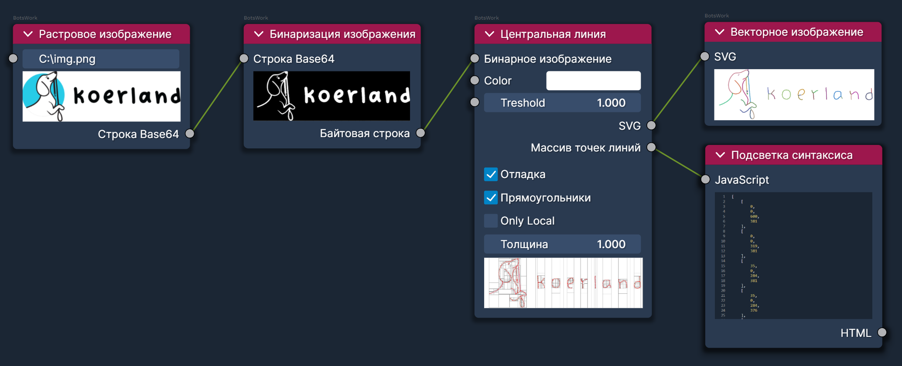

# node

## Пример использования

> Классификация параметров визуального программирования.
> Поток данных для построения пайплайнов обработки.



генератор ID в javascript

```js
Date.now()
1701430489823
```